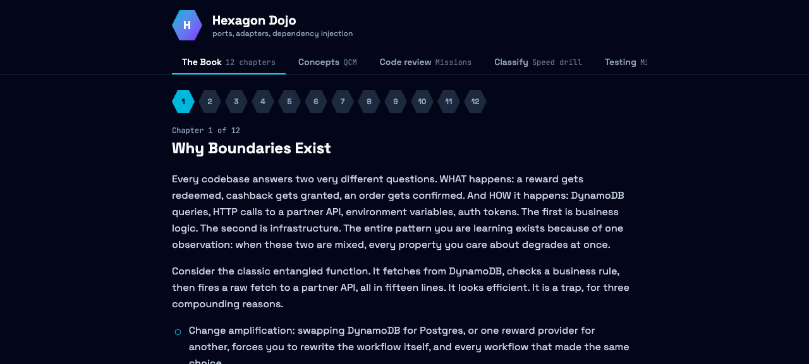

# hexagon-dojo

Interactive dojo for hexagonal architecture — ports, adapters and dependency injection, trained through a book, quizzes, code-review missions, drills and talk tracks.

[](https://github.com/PaulCailly/hexagon-dojo/actions/workflows/ci.yml) [](https://github.com/PaulCailly/hexagon-dojo/actions/workflows/quality-gate.yml) [](https://github.com/PaulCailly/hexagon-dojo/actions/workflows/compliance-gate.yml) [](https://hexagon-dojo.vercel.app) [](./LICENSE)

Hexagon Dojo turns the ports & adapters pattern into a training loop: read the theory, test the concepts, review realistic PRs, classify code at a glance, write tests without mocks, and rehearse the vocabulary — all in the browser, no account, progress saved locally.



## Modules

- **The Book** — 20 chapters in 4 parts (Foundations · Testing · Patterns at the Edge · Practice), from "Why Boundaries Exist" through unit/integration testing, contract tests, TDD, error contracts, the delivery edge, events and legacy refactoring — with per-chapter deep links and read tracking
- **Concepts** — 120 quiz questions in 10 themed sets with per-answer explanations and per-set best scores
- **Code review** — 10 missions: spot the real problems in a flawed PR (service locators, god ports, mock-everything suites, leaky handlers…), then compare with the fixed code
- **Classify** — 5 speed drills, 57 lines of code to classify: Port / Adapter / Use case / Composition root
- **Testing** — 5 missions: unit, integration, contract suites, decorator testing with a fake clock, outside-in TDD — self-graded against checklists and model answers
- **Talk tracks** — 36 filterable flashcards: system design, testing strategy, product mindset, AI collaboration, English phrasing, codebase reading

## Stack

Vite + React 18 + TypeScript · Tailwind CSS v4 · React Router 7 · Vitest + Testing Library · self-hosted fonts (`@fontsource`) · zero runtime dependencies beyond React — no backend, no analytics, progress lives in `localStorage`.

## Development

```bash
npm install
npm run dev        # local dev server
npm test           # vitest (scoring logic, storage, routing smoke tests)
npm run lint       # eslint
npm run build      # type-check + production bundle
```

Content is code: every chapter, question and card lives in `src/content/*.ts`. Editing content is a PR.

## Quality gates

This repo runs [gatekit](https://github.com/PaulCailly/gatekit) in report mode — code-health and privacy/compliance gates post a sticky report on every PR (current: health 98/100, compliance 100/100). Policy is owned in `scripts/health/config.mjs` and `scripts/compliance/*.mjs`; engines sync via `npx gatekit update`.

## Deployment

Deployed on Vercel via git integration: every PR gets a preview URL, `main` deploys to production. `vercel.json` rewrites all routes to `index.html` so deep links (e.g. `/book/7`) work.

## Roadmap

- **Mock interviewer** — AI-driven follow-up questions via a Vercel `/api` function
- **Accounts / cross-device sync** — `localStorage` is enough for v1
- **Content CMS** — for now, `src/content/` is the source of truth

## License

[MIT](./LICENSE)
